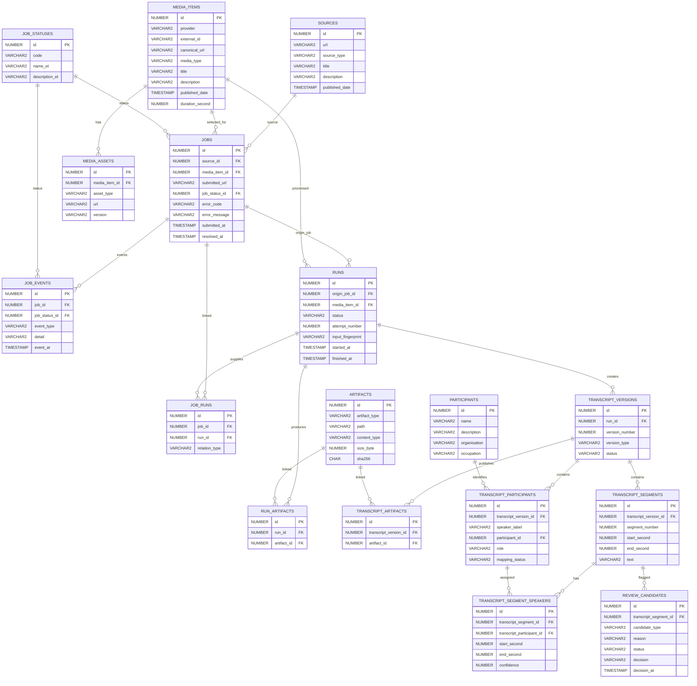

# ERR2TEXT ERD



## Ühised väljad ja soft delete

## Unikaalsused ja lubatud väärtused

| Tabel | Unikaalsus |
|---|---|
| `transcript_participants` | `UNIQUE (transcript_version_id, speaker_label)` |
| `job_runs` | `UNIQUE (job_id, run_id)` |
| `run_artifacts` | `UNIQUE (run_id, artifact_id)` |
| `transcript_artifacts` | `UNIQUE (transcript_version_id, artifact_id)` |

`transcript_versions.version_type` lubatud väärtused:

```text
AUTOMATIC_DRAFT
REVIEWED_DRAFT
FINAL
```

`review_candidates.status` lubatud väärtused:

```text
PENDING
ACCEPTED
REJECTED
MODIFIED
```

`transcript_participants.mapping_status` lubatud väärtused:

```text
UNCONFIRMED
CONFIRMED
UNKNOWN
```

Erandina võib `transcript_participants.participant_id` olla `NULL`, kuni
kasutaja kinnitab päris inimese või märgib kõneleja tundmatuks.

Kõigil tabelitel on lisaks diagrammil näidatud väljadele järgmised väljad:

| Veerg | Tüüp | Reegel / tähendus |
|---|---|---|
| `id` | `NUMBER` | Primary key; tabeli sequence'i järgmine väärtus |
| `start_date` | `DATE` | Kehtivuse algus; vaikimisi `SYSDATE` |
| `end_date` | `DATE` | Sulgemise aeg; füüsilist kustutamist ei kasutata |
| `created` | `TIMESTAMP` | Loomise aeg; vaikimisi `SYSTIMESTAMP` |
| `last_updated` | `TIMESTAMP` | Muutmise aeg; API määrab muutmisel |

Aktiivne kirje vastab tingimusele:

```sql
end_date IS NULL OR end_date > SYSDATE
```
