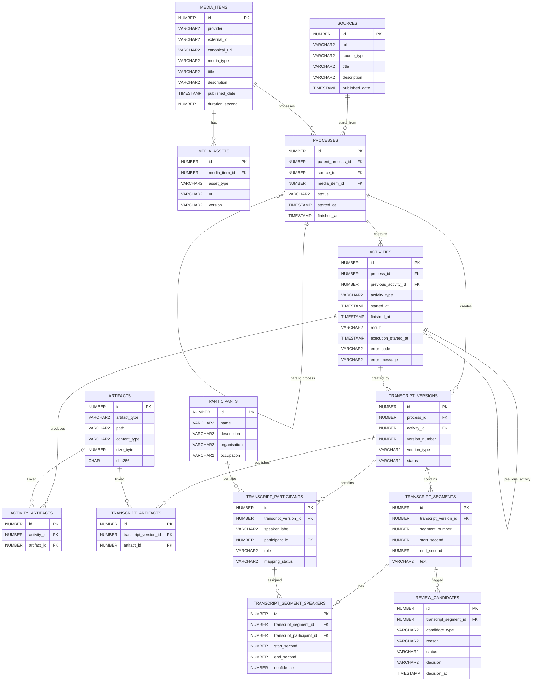

# ERR2TEXT ERD

See mudel kirjeldab ühte transkribeerimisprotsessi ja selle järjestikuseid
tegevusi. Protsess luuakse pärast kasutaja kinnitust.



## Protsessi ja tegevuse reeglid

- Protsess luuakse alles pärast seda, kui kasutaja on meedia valiku ja
  transkribeerimise alustamise kinnitanud.
- Protsessi `started_at` on esimese tegevuse algus. `finished_at` tekib alles
  BPMN-i lõpusündmuseni jõudmisel.
- Aktiivse protsessi `status` on parajasti lõpetamata tegevuse
  `activity_type`. Lõppenud protsessi staatus on `FINISHED` või `CANCELLED`.
- Tegevusel ei ole muutuvat staatust. Tegevusel on algus, lõpp ja tulemus.
- Tegevuse `result` tekib ainult koos `finished_at` väärtusega. Lubatud
  tulemused on `OK`, `ERROR` ja `CANCELLED`. Pooleli tegevusel on mõlemad
  väärtused `NULL`.
- Taustal käivitataval tegevusel võib olla tehniline
  `execution_started_at`. See näitab, et worker on tegevuse endale hõivanud;
  see ei ole tegevuse äriline staatus ega tulemus.
- Diariseerimise samaaegsuse ülempiir tuleb konfiguratsioonist
  `ERR2TEXT_MAX_CONCURRENT_DIARIZATIONS`; vaikimisi on väärtus `1`. Käimasolevaks
  diariseerimiseks loetakse tegevus, mille `activity_type` on `DIARIZING`,
  `execution_started_at` ei ole `NULL` ja `finished_at` on `NULL`.
- Worker hõivab tegevuse atomaarse andmebaasitehinguga. Hõivamata tegevust ei
  tohi teine worker samal ajal käivitada.
- Eelmise tegevuse lõpetamine, uue tegevuse lisamine ja protsessi staatuse
  uuendamine toimuvad ühe lühikese andmebaasitransaktsiooni sees.
- Pika tegevuse, nagu diariseerimise või kasutaja ülevaatuse ajal, ei hoita
  andmebaasitransaktsiooni avatuna. Alustamine ja lõpetamine on eraldi kiired
  transaktsioonid.
- Sama `activity_type` võib ühe protsessi sees korduda.

## Tegevuste ahela terviklikkus

`activities.process_id` on kohustuslik. `previous_activity_id` on esimese
tegevuse puhul `NULL`.

`activities` peab sisaldama unikaalsust `(process_id, id)` ning võõrvõti
`(process_id, previous_activity_id)` peab viitama sama tabeli samale
`process_id` väärtusele. Tegevus ei tohi viidata teise protsessi tegevusele.

## Seotud protsesside tehniline reegel

Kui kasutaja kinnitab uue protsessi, kuid sama meedia kohta on juba aktiivne
põhiprotsess, uut diariseerimist ei käivitata. Uue protsessi
`parent_process_id` viitab põhiprotsessile ja esimene tegevus on
`WAITING_FOR_RESULT`.

See tehniline sõltuvus ei ole BPMN-i põhijoonisel eraldi tegevusena kujutatud.
Taustal töötav kontroll lõpetab ootava protsessi, kui põhiprotsess lõpeb.

- Põhiprotsessi `FINISHED` korral lõpetatakse ootav protsess `FINISHED` ja
  seotakse sama transkriptsioonitulemus.
- Põhiprotsessi `CANCELLED` korral lõpetatakse ootav protsess `CANCELLED`.
- Kuni põhiprotsess kestab, puudub ootaval protsessil tulemus.

Ühel põhiprotsessil võib olla 0…n sõltuvat protsessi.

## Ühised veerud ja soft delete

Kõigil tabelitel on lisaks diagrammil näidatud veergudele järgmised ühised
veerud. `id`-veerg on diagrammil iga tabeli juures eraldi näidatud.

| Veerg | Tüüp | Reegel / tähendus |
|---|---|---|
| `start_date` | `DATE` | Kehtivuse algus; vaikimisi `SYSDATE` |
| `end_date` | `DATE` | Sulgemise aeg; füüsilist kustutamist ei kasutata |
| `created` | `TIMESTAMP` | Loomise aeg; vaikimisi `SYSTIMESTAMP` |
| `last_updated` | `TIMESTAMP` | Muutmise aeg; API määrab muutmisel |

Aktiivne kirje vastab tingimusele:

```sql
end_date IS NULL OR end_date > SYSDATE
```

## Transkriptsiooniversioonide lubatud väärtused

`transcript_versions.version_type`:

```text
AUTOMATIC_DRAFT
REVIEWED_DRAFT
FINAL
```

`transcript_participants.mapping_status`:

```text
UNCONFIRMED
CONFIRMED
UNKNOWN
```

Erandina võib `transcript_participants.participant_id` olla `NULL`, kuni
kasutaja kinnitab päris inimese või märgib kõneleja tundmatuks.
